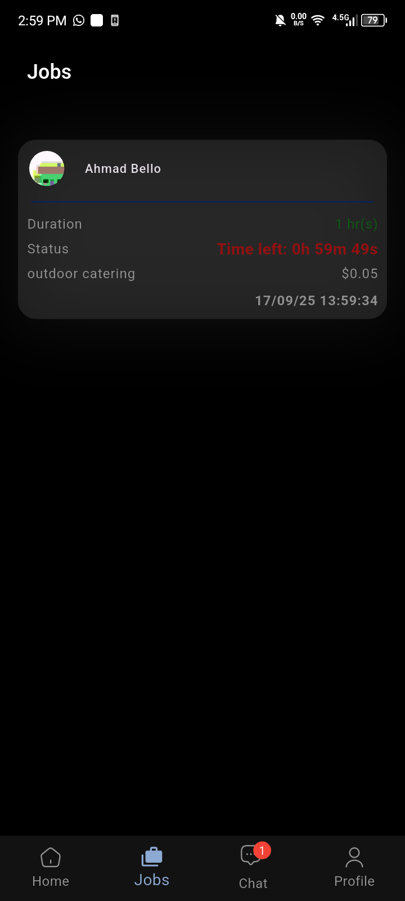

# Vider

**Vider** is a freelancer app that connects clients with service providers within their location.  
This app allows users to:

1. Search for service providers nearby using maps.  
2. View service provider portfolios and details of the services they render.  
3. Exchange text messages with service providers.  
4. Send job requests to service providers.  
5. Make crypto payments after completing each job.  

The app is built with **Flutter** for the frontend, **Node.js** for the backend, and **MongoDB** for data storage.  

---

## Architecture

The app follows a **Model–View–Controller (MVC)** software architecture:

- **Models**  
  Represent the data and business logic of the application.  
  Examples:  
  - `user_model` (username, lastname, etc.)  
  - `job_model` (duration, status, etc.)  

- **Views**  
  Represent the **UI elements** visible to the user.  
  Examples: Login screen, Dashboard, Job listings.  

- **Controllers**  
  Handle user input, process requests, and decide what data from the Model goes to the View.  
  Example: `transaction_controller` fetches transactions from the backend and displays transaction details in the transaction history screen using the `transaction_model`.  

 All **state management** logic is handled with **flutter_riverpod**.  

---

## Screenshots & Features

### Authentication
- Sign In and Sign Up screens with all required form fields.  
- Input values are validated before submission.  
- Authentication tokens are stored securely.

### Home Screen
- Displayed after login.  
- The screen includes a search bar that displays matching results as soon as you type a letter.  
- A map button is attached to the search box, allowing quick navigation to the map screen.
- A grid view of service categories displays all available providers, grouped by category.
- A quick-access list of nearby service providers helps speed up the job initiation process.

### Map Screen 
- Shows current location of the user.  
- Shows the locations of all available service provider  
- ncludes a search box that allows users to find locations, with the map camera automatically zooming in on the selected result.  

### Notifications Screen 
- Shows a list of notifications including transactions, job updates, and other events.  
- Unread notifications are marked with colored indicators.  
- Notification badges are displayed on the home screen to alert users of new notifications.  

### Jobs
- Displays all jobs, with **active jobs pinned at the top**.  
- Includes a **timer indicator** to show remaining time for active jobs.  
- The hire provider screen allows users to specify job details before sending a request.

### Chat & Messaging
- Chat screen lists all client conversations with **unread indicators**.  
- Instant messaging powered by **WebSockets**.  
- Integrated with **Firebase Cloud Messaging (FCM)** so providers never miss messages or job updates.  

### Settings
- Settings screen provides access to:  
  - Wallet (balance + token deposits).  
  - App and profile customization options.  

---

flowchart TD

%% Users
U[Client/User] -->|Login / Register| A[Flutter Frontend]
P[Service Provider] -->|Login / Register| A

%% Authentication
A -->|Send credentials| B[Node.js Backend]
B -->|Verify & Store| C[(MongoDB)]
B -->|Return token| A

%% Home & Search
U -->|Search providers / categories| A
A -->|API Request: Search| B
B -->|Fetch providers| C
C -->|Return provider data| B
B -->|Send results| A
A -->|Show providers list / map| U

%% Jobs
U -->|Send job request| A
A -->|API Request: Create Job| B
B -->|Store job| C
B -->|Notify provider| WS[WebSockets/FCM]
P -->|Accept/Reject job| A
A -->|Update job status| B
B -->|Update job record| C

%% Messaging
U -->|Chat message| A
A -->|Send via WebSocket| WS
WS -->|Deliver message| P
P -->|Reply| WS
WS -->|Deliver reply| U

%% Payments
U -->|Pay after job| A
A -->|Payment request| B
B -->|Crypto API| PAY[Crypto Payment Gateway]
PAY -->|Confirm payment| B
B -->|Update wallet| C
B -->|Notify provider| WS

%% Notifications
B -->|Send updates| WS
WS -->|Push notifications| U
WS -->|Push notifications| P

---

## 🛠 Tech Stack
- **Frontend:** Flutter  
- **Backend:** Node.js  
- **Database:** MongoDB  
- **State Management:** Riverpod  
- **Messaging/Notifications:** WebSockets & Firebase Cloud Messaging  
- **Payments:** Crypto-based payments  

---
