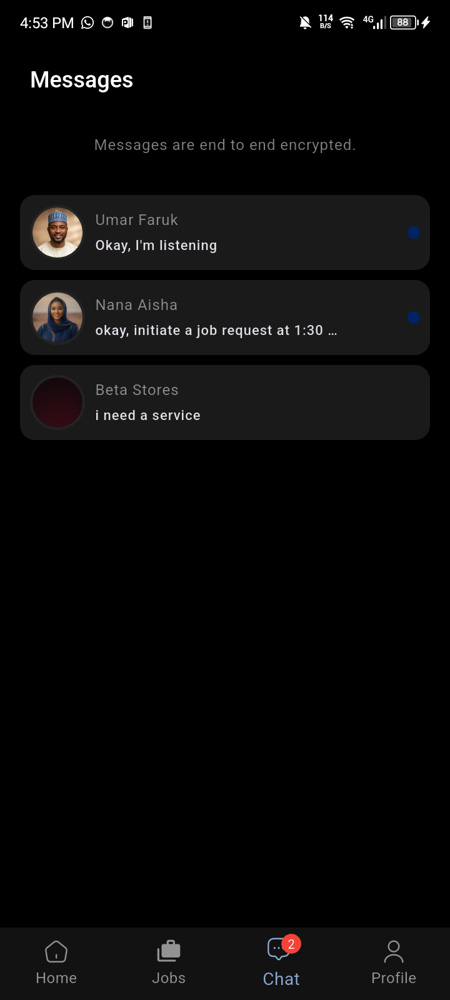

# Vider

**Vider** is a freelancer app that connects clients with service providers within their location.  
This app allows users to:

1. Search for service providers nearby using maps.  
2. View service provider portfolios and details of the services they render.  
3. Exchange text messages with service providers.  
4. Send job requests to service providers.  
5. Make crypto payments after completing each job.  

The app is built with **Flutter** for the frontend, **Node.js** for the backend, and **MongoDB** for data storage.  

---

## Download APK (Beta)

If you want to try the Android app quickly, download the latest APK:

[](https://drive.google.com/drive/folders/1dWddvh0wEG59eH0ZC3gdfpZAK6wdE_uT?usp=sharing)

You can also check out the Vider Provider Repository:

[Vider Provider](https://github.com/ahmvddddd/vider_provider)
Companion app for service providers to manage portfolios, accept jobs, chat with clients, and receive payments.

---
## Quick Start Guide

1. **Sign Up / Log In**  
   - Create an account by submitting all required details or log in using your existing credentials.  

2. **Fund Your Wallet**  
   - Navigate to the profile tab and click on deposit to copy your crypto address. Fund your wallet by sending tokens to the address.

3. **Search for a Provider**  
   - Use the **home search bar** or **map screen** to find service providers near you.  

4. **View Provider Details**  
   - Open a provider’s profile to view their portfolio, ratings, and available services.  

5. **Send Job Request**  
   - Enter your **transaction PIN** and send a job request with details like job type, duration, and pay.  

6. **Provider Accepts**  
   - You would receive a notification if the provider accepts your request, the job will be initiated.  

7. **Job in Progress**  
   - Track the job’s status in the **Jobs screen** (active jobs appear at the top with a timer).  

8. **Payment**  
   - Once the job is completed, payment fee would be deducted from your wallet.  

---

## Data Flow

A simple diagram of how the app works:


---

## Architecture

The app follows a **Model–View–Controller (MVC)** software architecture:

- **Models**  
  Represent the data and business logic of the application.  
  Examples:  
  - `user_model` (username, lastname, etc.)  
  - `job_model` (duration, status, etc.)  

- **Views**  
  Represent the **UI elements** visible to the user.  
  Examples: Login screen, Dashboard, Job listings.  

- **Controllers**  
  Handle user input, process requests, and decide what data from the Model goes to the View.  
  Example: `transaction_controller` fetches transactions from the backend and displays transaction details in the transaction history screen using the `transaction_model`.  

 All **state management** logic is handled with **flutter_riverpod**.  

---

## Screenshots & Features

### Authentication
- Sign In and Sign Up screens with all required form fields.  
- Input values are validated before submission.  
- Authentication tokens are stored securely.

<p align="center">


</p>

### Home Screen
- Displayed after login.  
- The screen includes a search bar that displays matching results as soon as you type a letter.  
- A map button is attached to the search box, allowing quick navigation to the map screen.
- A grid view of service categories displays all available providers, grouped by category.
- A quick-access list of nearby service providers helps speed up the job initiation process.


### Map Screen 
- Shows current location of the user.  
- Shows the locations of all available service providers.  
- Includes a search box that allows users to find locations, with the map camera automatically zooming in on the selected result.  


### Notifications Screen 
- Shows a list of notifications including transactions, job updates, and other events.  
- Unread notifications are marked with colored indicators.  
- Notification badges are displayed on the home screen to alert users of new notifications.  


### Jobs
- Displays all jobs, with **active jobs pinned at the top**.  
- Includes a **timer indicator** to show remaining time for active jobs.  
- The hire provider screen allows users to specify job details before sending a request.

<p align="center">


</p>

### Chat & Messaging
- Chat screen lists all client conversations with **unread indicators**.  
- Instant messaging powered by **WebSockets**.  
- Integrated with **Firebase Cloud Messaging (FCM)** so providers never miss messages or job updates.  

<p align="center">


</p>

### Settings
- Settings screen provides access to:  
  - Wallet (balance + token deposits).  
  - App and profile customization options.  


---

##  Tech Stack
- **Frontend:** Flutter  
- **Backend:** Node.js  
- **Database:** MongoDB  
- **State Management:** Riverpod  
- **Messaging/Notifications:** WebSockets & Firebase Cloud Messaging  
- **Payments:** Crypto-based payments  

---

## Developer Guide — Clone & Run

### Prerequisites
- Flutter SDK (stable channel) and Android SDK
- A GitHub account (for cloning/pushing)
- Optional: `flutter_dotenv` for environment variables in Flutter

1. Clone the repository
```
   git clone https://github.com/ahmvddddd/vider.git
```
Navigate to the project directory:
```
cd vider
```

2. Install dependencies
Run the following command to fetch all the packages:
```
flutter pub get
```

3. Run the app
Make sure a device or emulator is running, then execute:
```
flutter run
```

4. Build APK (Android)
To build a release APK:
```
flutter build apk
```
Build for iOS (MacOS only)
To build the app for iOS:
```
flutter build ios
```

5. Troubleshooting
Run flutter doctor to check for setup issues:
```
flutter doctor

```
To clean the build:
```
flutter clean
flutter pub get
```